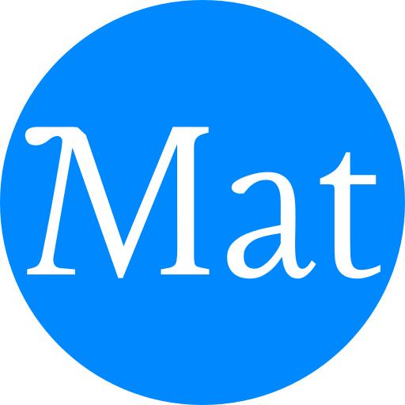

#  Meal-accounting-tool
A simple local web app for recipes and meal planning. 

## History
### 230903
Idea conceived and began working on the project.
- Simple prototype using external read/write

### 230908
Migrated the project to this current repository.
- Proper database using Prisma
- Important core features implemented
  - Users
  - Posts
  - Calendar

### 231010(ish)
Could be considered a pre-alpha state
